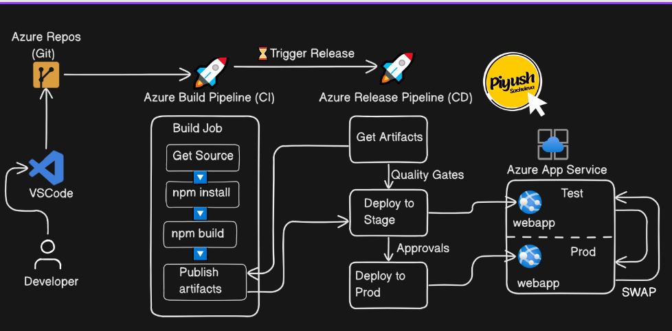

# AzureXperience - CSK | DeKut
 - Deploy your app in simple steps to azure app service with zero down time. 3 demonstrated options

## Who am I? https://www.linkedin.com/in/ronney-otieno/
[](https://www.linkedin.com/in/ronney-otieno/)

- Automating Deployment with a multi-stage Release Pipelines
- Continuous Deployment Triggers
- Continuous delivery using deployment slots to enable Blue-Green deployment
- Deployment gates such as Query Work Items and Approvals before the prod deployment
- Update the code to test the entire CICD process with the Build and Release pipeline

**build pipeline yaml**
```
trigger:
  - main

stages:
  - stage: Build
    jobs:
      - job: Build
        pool: SelfHostedPool
        steps:
          - task: Npm@1
            inputs:
              command: 'install'
          - task: Npm@1
            inputs:
              command: 'custom'
              customCommand: 'run build'
          - task: PublishBuildArtifacts@1
            inputs:
              PathtoPublish: 'build'
              ArtifactName: 'drop'
              publishLocation: 'Container'
  
  - stage: Deploy
    jobs:
      - job: Deploy
        pool: SelfHostedPool
        steps:
        - task: DownloadBuildArtifacts@1
          inputs:
            buildType: 'current'
            downloadType: 'single'
            artifactName: 'drop'
            downloadPath: '$(System.ArtifactsDirectory)'
        - task: AzureRmWebAppDeployment@4
          inputs:
            ConnectionType: 'AzureRM'
            azureSubscription: 'Azure for Students (d1bc7cf6-c398-4aeb-898c-d187c2787ac7)'
            appType: 'webAppLinux'
            WebAppName: 'azure-xperience'
            packageForLinux: '$(System.ArtifactsDirectory)/drop'
            RuntimeStack: 'STATICSITE|1.0'
```



